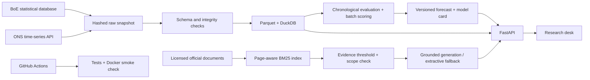

# Open Finance Intelligence

[](https://github.com/shrut10/open-finance-intelligence/actions/workflows/ci.yml)

A UK macroeconomic research desk: explore official indicators, inspect an inflation nowcast, and ask policy questions with linked evidence. Built by [Jayashruthi Rajesh Babu](https://jayashruthi.com).

**[Open the research desk](https://open-finance-intelligence.vercel.app)** · **[Interactive API](https://open-finance-intelligence.vercel.app/docs)** · **[Health](https://open-finance-intelligence.vercel.app/health)**

## What it does

- Ingests real **Bank of England** Bank Rate and M4 money stock, plus **ONS** CPI inflation and unemployment. Preserves raw responses, retrieval timestamps, source URLs, hashes and licence attribution.
- Serves parameterised **DuckDB** queries over a versioned **Parquet** snapshot.
- Compares persistence, seasonal naive, ridge regression and gradient boosting using chronological train/validation/test periods, publication-lag assumptions and block permutation importance.
- Retrieves page-aware passages from four licensed **BoE/FCA/HM Treasury** publications using BM25, rejects weak or out-of-scope questions, and links every returned source.
- Supports grounded LLM generation through an OpenAI-compatible provider, with citation and evidence checks. When generation is unavailable or fails validation, the UI explicitly labels the extractive fallback.
- Ships one **FastAPI** service and a responsive, dependency-free web interface, with **Docker**, **GitHub Actions**, offline tests and deployment smoke checks.

This is an inspectable research demonstration. It does not provide investment recommendations or claim real-time data.

## Run locally

Python 3.12 is required. The actual data snapshot, retrieval index and forecast artifacts are included, so running the app does not need a data download or an API key.

```bash
python3.12 -m venv .venv
source .venv/bin/activate
pip install -r requirements.txt
python -m uvicorn app:app --reload --port 8000 --no-access-log
```

Visit `http://localhost:8000` and `http://localhost:8000/docs`.

Or run the same service in its non-root, read-only container:

```bash
docker compose up --build
```

For generated rather than extractive answers, copy `.env.example` to `.env`, set the provider variables, and export them into the process (or use Docker Compose, which reads `.env`). `OFI_LLM_ENABLED=true`, a model name and a provider credential are required. On Vercel, AI Gateway can use the project's automatic OIDC credential; no key belongs in browser code or GitHub. See [deployment and operations](docs/OPERATIONS.md).

## Architecture



Forecasts use **batch inference**: training generates an immutable, versioned forecast artifact, which the API serves. The public server neither retrains per request nor accepts arbitrary SQL, URLs, uploaded documents or invented forecast horizons.

## Evaluation: the result is the result

The initial snapshot was retrieved on **29 September 2026**. Training ends in December 2018, validation spans January 2019–December 2021, and the final chronological test spans January 2022–August 2026 (56 observations).

| Model | Validation MAE | Test MAE | Test RMSE |
|---|---:|---:|---:|
| Persistence | 0.347 | 0.405 | 0.602 |
| Seasonal naive | 1.297 | 3.554 | 4.395 |
| Ridge regression | 0.347 | **0.393** | **0.546** |
| Gradient boosting, selected on validation | **0.343** | 1.054 | 1.671 |

Errors are in percentage points of annual CPI inflation. **The selected model underperforms persistence on the test period.** Its nominal 90% empirical interval covers only **71.4%** of test observations. The dashboard exposes both findings. The test set was not used to select a different winner after seeing this result. This is evidence of the model's limits during a changing inflation regime, not a claim of superior forecasting.

The September 2026 estimate is a **current-month nowcast of the next CPI observation**, not a prediction issued before September began. Data are revised snapshots, with conservative publication-lag assumptions rather than true historical vintages. Read the [model card](docs/MODEL_CARD.md) before interpreting the chart or feature importance.

Retrieval evaluation has separate calibration and held-out question sets. Full per-question outcomes and limitations are saved in [the retrieval report](artifacts/rag_evaluation.json) and explained in [the RAG methodology](docs/RAG.md). Retrieval coverage and citation checks are not proof that every generated claim is correct.

## Reproduce the pipeline

```bash
pip install -r requirements-dev.txt
python scripts/build_data.py           # verify raw hashes; rebuild Parquet offline
python scripts/train.py                # evaluation, importance and batch forecast
python scripts/build_corpus.py         # rebuild index from bundled licensed documents
python scripts/evaluate_rag.py         # calibration and held-out evaluation
pytest -q
ruff check .
ruff format --check .
```

Use `python scripts/build_data.py --refresh` to fetch a new official data snapshot before rebuilding the model. A new snapshot can revise history and will change results; the release commit preserves the original experiment. The data-refresh workflow creates a reviewable artifact, rather than silently replacing a published scientific result.

```bash
python scripts/smoke_test.py --base-url http://localhost:8000
python scripts/smoke_test.py --base-url https://open-finance-intelligence.vercel.app
```

## API

| Route | Purpose |
|---|---|
| `GET /health` | Check bundled data, forecast and corpus readiness |
| `GET /api/overview` | Dashboard metadata, forecast, evaluation and source catalogue |
| `GET /api/series` | Discover supported series and provenance |
| `GET /api/data/{series_id}?start=2020-01-01&end=2025-12-31` | Filter observations by date |
| `GET /api/forecast` | Versioned next-observation batch forecast and uncertainty |
| `GET /api/evaluation` | Temporal splits, baseline errors, backtest and importance |
| `GET /api/corpus` | Publication dates, source links and document metadata |
| `POST /api/ask` | JSON `{"question":"What is the UK inflation target?"}` |

Try asking **“What is the UK inflation target?”**, **“Who oversees critical third parties?”**, or **“What privacy protections were proposed for the digital pound?”** The corpus is dated and scoped: current interest-rate values belong in the structured indicator view, not in historical policy text.

## Repository guide

| Location | Contents |
|---|---|
| `src/ofi/` | API, data access, features, retrieval and generation |
| `scripts/` | Reproducible ingestion, training, evaluation and smoke tests |
| `data/raw/` | Actual official statistical responses and manifest |
| `data/processed/` | Parquet observations and series metadata |
| `data/corpus/` | Licensed source documents, index and retrieval evaluation set |
| `artifacts/` | Versioned forecast, backtest and retrieval report |
| `web/` | Accessible responsive HTML, CSS and JavaScript |
| `tests/` | Data integrity, temporal causality, retrieval, provider and API tests |

## Scope and licences

Original code is MIT licensed. Statistical datasets and the selected document corpus are separately attributed under the Open Government Licence v3.0; see [data provenance](docs/DATA.md) and [document provenance](docs/RAG.md). No Baringa, client or private portfolio data are used. The named public institutions do not endorse this project.

Operational limits are explicit: a small English-language corpus, a single historical snapshot, no vintage backtest, a model that lost to its simple baseline on hold-out data, and best-effort per-instance API limits. See [operations](docs/OPERATIONS.md) for freshness, generation fallback, costs, privacy and deployment details.
